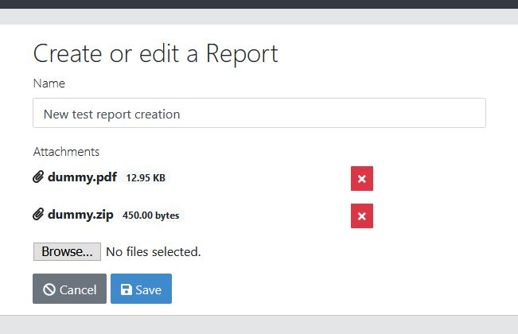
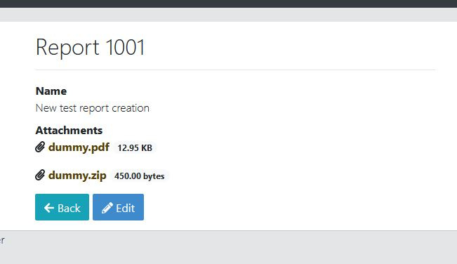

# jhAttachments

This application was generated using JHipster 6.8.0, you can find documentation and help at [https://www.jhipster.tech/documentation-archive/v6.8.0](https://www.jhipster.tech/documentation-archive/v6.8.0).

## About this repo

This repository is intended to give a general implementation of file attachments within JHipster, business logic has been left out to simplify the changes required to integrate it into your own project. This includes, for example, how to manage entity deletion (what todo with the attachments) or how to secure attachment download.

Some (most) of the implementation decisions were taken due to my own requirements, as file attachments have been a constant in most of my projects. For example, how I name the files on the server and how do I store them once uploaded. One of the requirement is that it should be easy to include attachments into new entities, that's why designed a single attachment entity with potentially several many-to-many relationships to other entities.

The location for file storage is configured in [application-dev.yml](./src/main/resources/config/application-dev.yml) and [application-prod.yml](./src/main/resources/config/application-prod.yml) respectively. Under the directory configured here, the uploaded files will be stored inside /YEAR/MONTH subdirectories (based on upload date) to avoid cluttering a single dir with too many files.

This project only has two entities: `Report` is only an example entity in which I integrated attachments, while `Attachment` is the core entity that contains all the functionalities. If you want to test how it works, the easiest way is to fire up the project, go to create or edit a `Report` and start playing around the the attachments.

The most relevant files are the following:

- [attachments.jh](./model/attachments.jh): JDL model used to generate this project
- [AttachmentService.java](./src/main/java/io/github/vicpermir/service/AttachmentService.java): File management logic and helpers
- [AttachmentDTO.java](./src/main/java/io/github/vicpermir/service/dto/AttachmentDTO.java): Attachment data to persist and file payload to store (base64)
- [AttachmentResource.java](./src/main/java/io/github/vicpermir/web/rest/AttachmentResource.java): Attachment download mapping
- [attachment-upload.component.ts](./src/main/webapp/app/shared/attachments/attachment-upload.component.ts): Component to manage attachment upload when editing or creating a new `Report`
- [attachment-download.component.ts](./src/main/webapp/app/shared/attachments/attachment-download.component.ts): Component to manage attachment download when you view a `Report`

## Preview

I didn't spend much time in the visual design (again, I kept everything as simple as possible), but here they go:





## Development

Before you can build this project, you must install and configure the following dependencies on your machine:

1. [Node.js][]: We use Node to run a development web server and build the project.
   Depending on your system, you can install Node either from source or as a pre-packaged bundle.

After installing Node, you should be able to run the following command to install development tools.
You will only need to run this command when dependencies change in [package.json](package.json).

    npm install

We use npm scripts and [Webpack][] as our build system.

Run the following commands in two separate terminals to create a blissful development experience where your browser
auto-refreshes when files change on your hard drive.

    ./mvnw
    npm start

Npm is also used to manage CSS and JavaScript dependencies used in this application. You can upgrade dependencies by
specifying a newer version in [package.json](package.json). You can also run `npm update` and `npm install` to manage dependencies.
Add the `help` flag on any command to see how you can use it. For example, `npm help update`.

The `npm run` command will list all of the scripts available to run for this project.

### PWA Support

JHipster ships with PWA (Progressive Web App) support, and it's turned off by default. One of the main components of a PWA is a service worker.

The service worker initialization code is commented out by default. To enable it, uncomment the following code in `src/main/webapp/index.html`:

```html
<script>
  if ('serviceWorker' in navigator) {
    navigator.serviceWorker.register('./service-worker.js').then(function() {
      console.log('Service Worker Registered');
    });
  }
</script>
```

Note: [Workbox](https://developers.google.com/web/tools/workbox/) powers JHipster's service worker. It dynamically generates the `service-worker.js` file.

### Managing dependencies

For example, to add [Leaflet][] library as a runtime dependency of your application, you would run following command:

    npm install --save --save-exact leaflet

To benefit from TypeScript type definitions from [DefinitelyTyped][] repository in development, you would run following command:

    npm install --save-dev --save-exact @types/leaflet

Then you would import the JS and CSS files specified in library's installation instructions so that [Webpack][] knows about them:
Edit [src/main/webapp/app/vendor.ts](src/main/webapp/app/vendor.ts) file:

```
import 'leaflet/dist/leaflet.js';
```

Edit [src/main/webapp/content/scss/vendor.scss](src/main/webapp/content/scss/vendor.scss) file:

```
@import '~leaflet/dist/leaflet.css';
```

Note: There are still a few other things remaining to do for Leaflet that we won't detail here.

For further instructions on how to develop with JHipster, have a look at [Using JHipster in development][].

### Using Angular CLI

You can also use [Angular CLI][] to generate some custom client code.

For example, the following command:

    ng generate component my-component

will generate few files:

    create src/main/webapp/app/my-component/my-component.component.html
    create src/main/webapp/app/my-component/my-component.component.ts
    update src/main/webapp/app/app.module.ts

## Building for production

### Packaging as jar

To build the final jar and optimize the jhAttachments application for production, run:

    ./mvnw -Pprod clean verify

This will concatenate and minify the client CSS and JavaScript files. It will also modify `index.html` so it references these new files.
To ensure everything worked, run:

    java -jar target/*.jar

Then navigate to [http://localhost:8080](http://localhost:8080) in your browser.

Refer to [Using JHipster in production][] for more details.

### Packaging as war

To package your application as a war in order to deploy it to an application server, run:

    ./mvnw -Pprod,war clean verify

## Testing

To launch your application's tests, run:

    ./mvnw verify

### Client tests

Unit tests are run by [Jest][] and written with [Jasmine][]. They're located in [src/test/javascript/](src/test/javascript/) and can be run with:

    npm test

For more information, refer to the [Running tests page][].

### Code quality

Sonar is used to analyse code quality. You can start a local Sonar server (accessible on http://localhost:9001) with:

```
docker-compose -f src/main/docker/sonar.yml up -d
```

You can run a Sonar analysis with using the [sonar-scanner](https://docs.sonarqube.org/display/SCAN/Analyzing+with+SonarQube+Scanner) or by using the maven plugin.

Then, run a Sonar analysis:

```
./mvnw -Pprod clean verify sonar:sonar
```

If you need to re-run the Sonar phase, please be sure to specify at least the `initialize` phase since Sonar properties are loaded from the sonar-project.properties file.

```
./mvnw initialize sonar:sonar
```

or

For more information, refer to the [Code quality page][].

## Using Docker to simplify development (optional)

You can use Docker to improve your JHipster development experience. A number of docker-compose configuration are available in the [src/main/docker](src/main/docker) folder to launch required third party services.

For example, to start a postgresql database in a docker container, run:

    docker-compose -f src/main/docker/postgresql.yml up -d

To stop it and remove the container, run:

    docker-compose -f src/main/docker/postgresql.yml down

You can also fully dockerize your application and all the services that it depends on.
To achieve this, first build a docker image of your app by running:

    ./mvnw -Pprod verify jib:dockerBuild

Then run:

    docker-compose -f src/main/docker/app.yml up -d

For more information refer to [Using Docker and Docker-Compose][], this page also contains information on the docker-compose sub-generator (`jhipster docker-compose`), which is able to generate docker configurations for one or several JHipster applications.

## Continuous Integration (optional)

To configure CI for your project, run the ci-cd sub-generator (`jhipster ci-cd`), this will let you generate configuration files for a number of Continuous Integration systems. Consult the [Setting up Continuous Integration][] page for more information.

[jhipster homepage and latest documentation]: https://www.jhipster.tech
[jhipster 6.8.0 archive]: https://www.jhipster.tech/documentation-archive/v6.8.0
[using jhipster in development]: https://www.jhipster.tech/documentation-archive/v6.8.0/development/
[using docker and docker-compose]: https://www.jhipster.tech/documentation-archive/v6.8.0/docker-compose
[using jhipster in production]: https://www.jhipster.tech/documentation-archive/v6.8.0/production/
[running tests page]: https://www.jhipster.tech/documentation-archive/v6.8.0/running-tests/
[code quality page]: https://www.jhipster.tech/documentation-archive/v6.8.0/code-quality/
[setting up continuous integration]: https://www.jhipster.tech/documentation-archive/v6.8.0/setting-up-ci/
[node.js]: https://nodejs.org/
[yarn]: https://yarnpkg.org/
[webpack]: https://webpack.github.io/
[angular cli]: https://cli.angular.io/
[browsersync]: https://www.browsersync.io/
[jest]: https://facebook.github.io/jest/
[jasmine]: https://jasmine.github.io/2.0/introduction.html
[protractor]: https://angular.github.io/protractor/
[leaflet]: https://leafletjs.com/
[definitelytyped]: https://definitelytyped.org/
